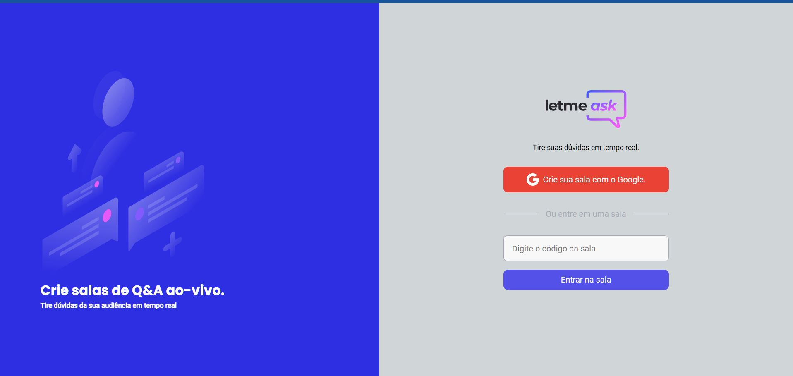
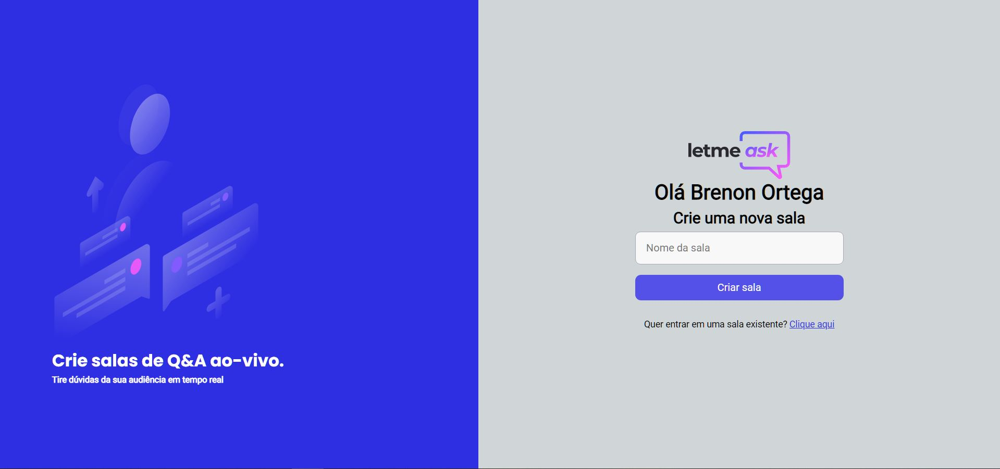
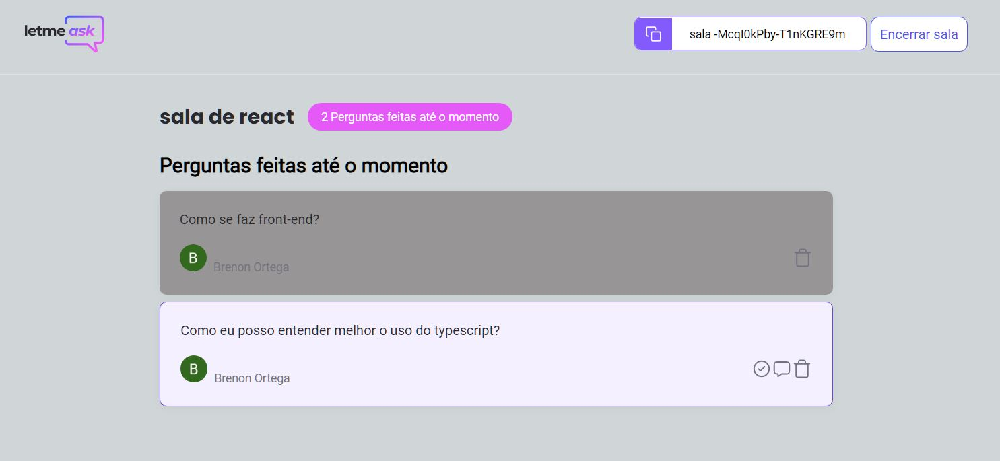
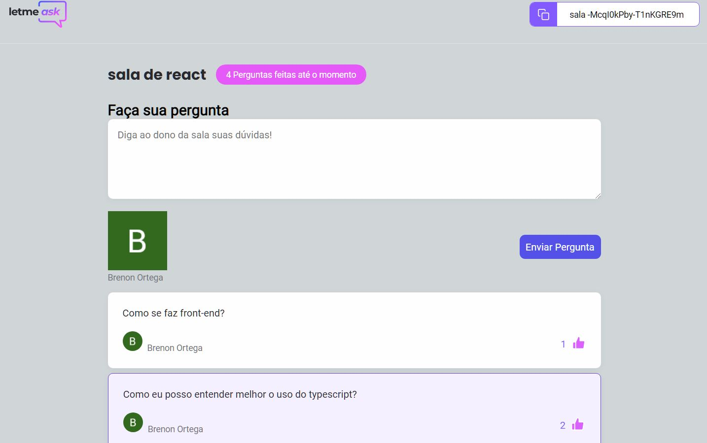

# Let Me Ask - Next Level Week 6
Projeto desenvolvido durante a Next Level Week de número 6 da Rocketseat.

## :dart: objetivo
O desenvolvimento de uma aplicação front-end utilizando [Typescript](), [ReactJS]() e [Google Firebase]() demonstrando os conceitos de BaaS (Back-end as a Service) e a utilização de bancos de dados não relacionais com o intuito de gerar uma plataforma para que streamers possam receber e responder perguntas de seus seguidoress de maneira centralizada em uma plataforma.
## :computer: Tecnologias Utilizadas
[Typescript](https://www.typescriptlang.org/)

[ReactJS](https://reactjs.org/)

[Sass](https://sass-lang.com/)

[Google Firebase](https://firebase.google.com/)

## :notebook: Aprendizados :fountain_pen:
 - Utilização da Context API do React para compartilhamento de estados.
 - Criação de hooks customizados para compartilhamento de funções dentro do código
 - utilização do pré-processador de CSS para estilização de páginas.
 - Criação de componentes React e implementação de atributos customizados.
 - Criação e utilização de tipos definidos através do typescript.
 - Utilização de bancos de dados não relacionais do firebase.
 - HTML, CSS e JS no geral, estou evoluindo no front-end ainda. :sweat_smile:
## :gear: Demonstração :hammer_and_wrench:
### - Tela Inicial

### - Criação de Uma Nova Sala

### - Visão do Administrador da Sala

### - Visão do Usuário da Sala.

